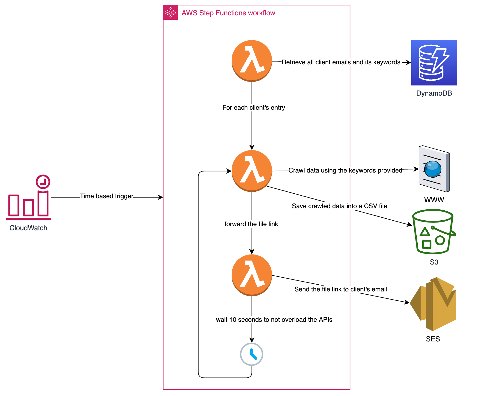
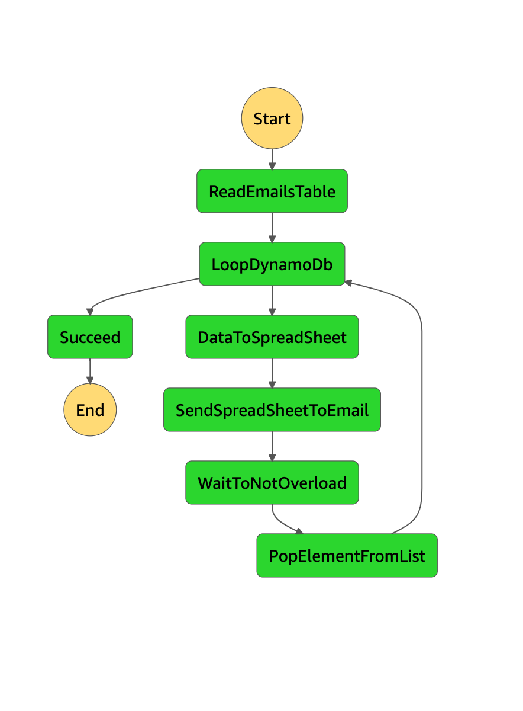

# Step Functions Workload
A AWS workload that is triggered by a CloudWatch time based event and executes the following actions:
1. Crawl products from a auction website
2. Parse and save the data into a S3 bucket
3. Send the downloadable link to an e-mail

⚠️ **USE AT YOUR OWN RISK** ⚠️

## Technical Details

- **deploy.sh**: execute everything needed for deployment
- **template.raw.yaml**: cloudformation description of the infrastructure, needs to be parsed with SAM
- **inject_steps.py**: small script to inject the json step functions template into our cloudformation template
- **src/lambda/***: contains all lambdas the stepfunctions will be executing
- **AWS Products**: Step Functions, Lambda, S3, DynamoDB, CloudWatch Events and SES

## Workload Diagram

## State Machine

